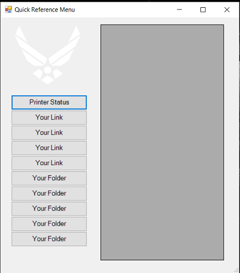

# Powershell-Projects
Various Powershell scripts I've created to help automate my work

## Menu_V1
This is a quick reference menu I built for work, instead of having my computer desktop being cluttered with folder shortcuts and links. </br>


## User Friendly Menu
Similar to Menu_V1, but more user friendly.  Instead of your file paths being hard coded in the ps1 file, you add your button names and links inside the Buttons.txt file.  Menu-V2.ps1 loops through and auto generates the specified button information.  This version strips the image box from the user form and also doesn't include the printer status check like the [Menu_V1](https://github.com/ds-designs/Powershell-Projects/blob/master/Menu-V1/Main_Menu.ps1) does <br />


### How to use
* Create a .txt file named Buttons.txt
* ButtonName is what you want the button to display, below for instance, we are creating buttons called Google, Reddit, Powershell, and Yahoo.  
* Action is the link to your frequently used folders and/or websites, the example below uses Google, Reddit, and an Example domain

```# Contents of 'Buttons.txt'
"ButtonName" "Action"

"Google" "https://www.google.com/"
"Reddit" "https://www.reddit.com/"
"r/PowerShell" "https://www.reddit.com/r/PowerShell"
"Yahoo" "https://www.yahoo.com/"
"Example" "http://example.com/"
```
The ps1 file will loop through this text file and dynamically create the amount of buttons specified in the Buttons.txt file.  Using this example, 5 buttons would be created.  It's still a work in progress, and not styleish yet, but I'm open to pull requests and help to better this one!
